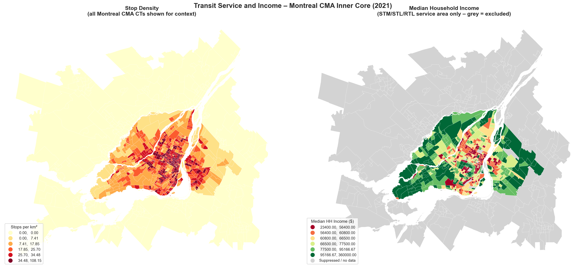

# Transit Equity in Montreal
### A spatial analysis of STM, STL and RTL service distribution across socioeconomic and demographic lines, using GTFS schedule data and 2021 Census demographics.

---

## The Question

Public transit systems are often evaluated on punctuality and ridership. A harder and more important question is whether service runs **where it matters most**. Are transit services equitably distributed across Montreal's neighbourhoods, or do lower-income and minority communities receive systematically worse service?

---

## Key Findings

**1. Population density, not demographics, drives stop coverage.**
Stop density across the STM/STL/RTL service area is overwhelmingly explained by population density (R² = 0.485). Once density is controlled for, no demographic variable (income, low-income rate, visible minority share, or renter rate) is a statistically significant predictor of how many stops a neighbourhood has.

**2. Lower-income Census Tracts are, on average, better served — but for geographic reasons.**
Stop density falls monotonically from the lowest-income quintile (35.1 stops/km², 10.1 min average headway) to the highest (15.5 stops/km², 19.2 min headway). This reflects the geography of Montreal's income distribution: lower-income CTs cluster in the dense urban core where transit has been concentrated for decades. It is not the result of deliberate equity-driven planning.

**3. Service frequency shows a significant collective demographic signal.**
A regression model for average headway (R² = 0.328) finds all 5 predictors (population density, median income, low-income rate, visible minority share, and renter rate) statistically significant. Extreme multicollinearity among predictors (VIF > 100) makes precise individual-coefficient interpretation unreliable, but the direction of all associations is consistent: urban-core CTs outperform suburban CTs on every service dimension simultaneously.

**4. The reliability gap is the key unknown.**
Scheduled GTFS data presents a relatively benign picture. But scheduled service is not experienced service. Whether service disruptions and cancellations fall disproportionately on lower-income neighbourhoods (potentially erasing their apparent paper advantage) cannot be answered without real-time reliability data.



---

## Data Sources

| # | Source | Description | Access |
|---|--------|-------------|--------|
| 1 | **STM GTFS** | Bus + metro schedules, island of Montreal | [stm.info/en/about/developers](https://www.stm.info/en/about/developers) |
| 2 | **STL GTFS** | Bus schedules, Laval | [stlaval.ca/open-data](https://stlaval.ca/about-us/public-information/open-data) |
| 3 | **RTL GTFS** | Bus schedules, Longueuil + South Shore | [rtl-longueuil.qc.ca/open-data](https://www.rtl-longueuil.qc.ca/en-CA/open-data/) |
| 4 | **StatsCan 2021 Census – Boundaries** | Census Tract polygons, Canada-wide | [statcan.gc.ca boundaries](https://www12.statcan.gc.ca/census-recensement/2021/geo/sip-pis/boundary-limites/) |
| 5 | **StatsCan 2021 Census – Profile** | CT-level demographics and income (2021 long-form) | [statcan.gc.ca profile](https://www12.statcan.gc.ca/census-recensement/2021/dp-pd/prof/details/download-telecharger.cfm) |

> **Note on scope:** exo's outer-suburb bus network and commuter rail, and the REM, are not included. exo's commuter rail operates a peak-hours model incompatible with headway-based urban service metrics; its bus network spans 10+ separate GTFS feeds requiring significant additional harmonisation. A full-CMA extension is documented as a next step in the notebook.

---

## Methodology

### Agency scope
The STM, STL and RTL collectively serve the inner urban core of the Montreal CMA with comparable, all-day, bus-oriented networks. Using these three agencies makes headway and stop-density metrics directly comparable across the study area.

### Multi-agency GTFS merging
Each GTFS feed uses its own internal ID numbering. All IDs (stop, trip, route, service) are prefixed with the agency code (`STM_`, `STL_`, `RTL_`) before merging to prevent collisions while preserving the ability to filter by operator at any point.

### Analysis subset
Of the 1,004 Census Tracts in the Montreal CMA shapefile, **713 contain at least one boarding stop** from the three agencies. The remaining 291 CTs (outer suburbs served by exo and other operators) are excluded from all demographic comparisons to avoid false "transit desert" classifications. This subset is referred to as `master_served` throughout the notebook.

### Service metrics
Three metrics are computed at the CT level from the GTFS schedule data:
- **Stop density**: boarding stops per km² (geographic access)
- **Weekly trips per stop**: mean vehicle visits per stop per week (frequency)
- **Average weekday headway**: mean minutes between consecutive vehicles at a stop on Mondays (rider wait time)

### Statistical analysis
- Spearman rank correlation (robust to non-normality) across all variable pairs
- OLS regression with log-transforms applied to skewed variables (|skew| > 1)
- VIF diagnostics to assess multicollinearity
- Residual diagnostics (residuals vs. fitted, Q-Q plots)

---

## How to Reproduce

```bash
# 1. Clone the repository
git clone https://github.com/YOUR_USERNAME/transit-equity-montreal.git
cd transit-equity-montreal

# 2. Create and activate the virtual environment
python -m venv .venv
source .venv/bin/activate        # Mac / Linux
.venv\Scripts\activate           # Windows

# 3. Install dependencies
pip install -r requirements.txt

# 4. Register the Jupyter kernel
python -m ipykernel install --user --name=transit-equity

# 5. Download data (see Section 3 of the notebook for detailed instructions)
#    Two files require manual download:
#    – STL GTFS: https://stlaval.ca/about-us/public-information/open-data
#      → save as data/raw/gtfs_stl/gtfs_stl.zip
#    – Census Profile: https://www12.statcan.gc.ca/census-recensement/2021/dp-pd/prof/details/download-telecharger.cfm
#      → select "Census metropolitan areas [...] and census tracts", download CSV
#      → save as data/raw/census/census_profile_ct.zip
#    All other files are downloaded automatically by the notebook.

# 6. Open the notebook
jupyter notebook notebooks/analysis.ipynb
# or in VS Code: open notebooks/analysis.ipynb and select the transit-equity kernel
```

**Python:** 3.11+  
**Key packages:** `pandas`, `geopandas`, `folium`, `matplotlib`, `seaborn`, `scipy`, `statsmodels`, `mapclassify`

---

## Repository Structure

```
transit-equity-montreal/
│
├── notebooks/
│   └── analysis.ipynb          ← Main analysis (Sections 1–9)
│
├── data/
│   ├── raw/                    ← Source data (gitignored, see download instructions above)
│   │   ├── gtfs_stm/
│   │   ├── gtfs_stl/
│   │   ├── gtfs_rtl/
│   │   └── census/
│   └── processed/              ← Derived GeoPackage (montreal_ct_master.gpkg)
│
├── figures/                    ← All exported charts and maps (8 figures)
│   ├── fig1_transit_distributions.png
│   ├── fig2_demographic_distributions.png
│   ├── fig3_map_service_vs_income.png
│   ├── fig4_map_headway_vs_lowincome.png
│   ├── fig5_service_by_income_quintile.png
│   ├── fig6_correlation_matrix.png
│   ├── fig7_scatter_plots.png
│   └── fig8_residual_diagnostics.png
│
├── requirements.txt
├── .gitignore
└── README.md
```

---

## Notebook Structure

| Section | Contents |
|---------|----------|
| 1. Setup | Imports, file paths, environment check |
| 2. Data Sources | Dataset descriptions and provenance |
| 3. Data Loading | GTFS parsing, Census boundary filtering, demographic profile extraction, multi-agency merge |
| 4. Service Metrics | Stop density, weekly trip frequency, and average headway computed per Census Tract |
| 5. Exploratory Data Analysis | Descriptive statistics, distributions, choropleth maps, income quintile comparison |
| 6. Main Analysis | Spearman correlation matrix, scatter plots, OLS regression with diagnostics |
| 7. Key Findings | Summary of results |
| 8. Recommendations | Policy-facing action items for transit agency planning departments |
| 9. Limitations & Next Steps | Methodological constraints and extensions |

---

## Author

**Bruna Bado**  
[LinkedIn](https://linkedin.com/in/brunabado) · [GitHub](https://github.com/bruna-bado)